# MyCSECPal Question Bank Strategy

Status: proposed content-production plan  
Last updated: 12 July 2026  
Initial target: CSEC Mathematics Paper 1 and Paper 2

## 0. Mathematics corpus audit - 12 July 2026

The repository currently contains:

- the CSEC Mathematics syllabus amended in October 2025;
- Mathematics Paper 2 files spanning historical and recent sittings;
- a Paper 2 topic-sorted collection and Mathematics study guide;
- Mathematics subject reports for May-June 2021, May-June 2024, May-June 2025 and January 2026.

### Critical syllabus-version finding

The amended syllabus states that it is effective for examinations from **May-June 2027**. It must not be treated as the structure used by the 2021-2026 papers.

The system therefore needs at least two explicitly versioned blueprint eras:

| Blueprint era | Evidence source | Paper 1 | Paper 2 |
|---|---|---|---|
| `legacy-through-jan-2027` | Historical papers and 2021-2026 subject reports | 60 multiple-choice items across the outgoing syllabus | 10 compulsory questions, 100 marks: seven questions worth 64 marks plus three 12-mark questions |
| `may-june-2027-onward` | Amended October 2025 syllabus and its specimen papers/keys | 60 multiple-choice items: 20 from each of three modules | Nine compulsory structured questions: three per module, 90 raw marks |

Historical papers remain useful for task shapes, common misconceptions, wording and difficulty evidence. They must not override the May-June 2027 blueprint.

### May-June 2027 Paper 1 blueprint

Paper 1 has 60 one-mark multiple-choice questions completed in 1 hour 30 minutes.

| Module | Topic | Required items |
|---|---|---:|
| 1 | Number Theory and Computation | 4 |
| 1 | Consumer Arithmetic | 4 |
| 1 | Sets | 3 |
| 1 | Measurement | 4 |
| 1 | Algebra 1 | 3 |
| 1 | Introduction to Graphs | 2 |
| 2 | Statistics 1 | 4 |
| 2 | Algebra 2 | 4 |
| 2 | Relations, Functions and Graphs 1 | 4 |
| 2 | Geometry and Trigonometry 1 | 4 |
| 2 | Vectors and Matrices 1 | 4 |
| 3 | Statistics 2 | 4 |
| 3 | Relations, Functions and Graphs 2 | 6 |
| 3 | Geometry and Trigonometry 2 | 6 |
| 3 | Vectors and Matrices 2 | 4 |
| | **Total** | **60** |

The specimen Paper 1 key also maps every item to a specific syllabus objective and one assessed profile: Conceptual Knowledge, Algorithmic Knowledge or Reasoning. The production schema and assembler must preserve that dimension; an easy/medium/hard label alone is insufficient.

Within each module, the Paper 1 raw profile target is:

| Profile | Items per module | Items in regular 60-question paper |
|---|---:|---:|
| Conceptual Knowledge | 6 | 18 |
| Algorithmic Knowledge | 8 | 24 |
| Reasoning | 6 | 18 |

This 30/40/30 profile balance is an official blueprint constraint. Difficulty remains a separate, empirically calibrated property.

### May-June 2027 Paper 2 blueprint

Paper 2 has nine compulsory structured questions, three from each module, worth 90 raw marks. Each module contributes 30 raw marks.

| Module | Assessed allocation | Raw marks |
|---|---|---:|
| 1 | Consumer Arithmetic, Number Theory and Computation | 9 |
| 1 | Graphs, Sets, Measurement and Algebra 1 | 12 |
| 1 | Investigation across Module 1 objectives | 9 |
| 2 | Algebra 2, and Relations, Functions and Graphs 1 | 12 |
| 2 | Geometry and Trigonometry 1 | 9 |
| 2 | Statistics 1 | 6 |
| 2 | Vectors and Matrices 1 | 3 |
| 3 | Vectors and Matrices 2 | 9 |
| 3 | Relations, Functions and Graphs 2 | 6 |
| 3 | Geometry and Trigonometry 2 | 9 |
| 3 | Statistics 2 | 6 |
| | **Total** | **90** |

The syllabus explicitly allows questions to combine topics within a module to produce those mark allocations. Consequently:

- the parent Paper 2 question maps to one module;
- each question part maps to one or more specific objectives/topics;
- the assembler validates module-level question and mark totals, not a simplistic rule that every parent question has exactly one topic.

The format table states 2 hours 30 minutes, while the included 2025 specimen paper states 2 hours 40 minutes. The product decision is to use **2 hours 40 minutes (9,600 seconds)** for the May-June 2027 Paper 2 blueprint. Duration remains versioned so a later official correction can be applied without changing historical attempts.

### Subject-report findings to use

The reports are most valuable as an error taxonomy for distractors, rubrics and feedback. Repeated observable issues include:

- failure to follow the exact command, such as proving a result versus solving an equation;
- missing working on questions that explicitly require a demonstration;
- place-value and estimation errors;
- weak algebraic transposition, factorisation and handling of negative terms;
- selecting an intermediate value rather than the value requested;
- incorrect or missing units and premature rounding;
- using linear scale factors for areas;
- incorrect trigonometric ratios and incomplete geometrical reasoning;
- incomplete transformation descriptions;
- graph scale, plotting, curve and inequality-shading errors;
- confusion with inverse/composite functions;
- failure to justify parallel vectors, restrictions on matrix inverses and matrix multiplication order;
- difficulty generalising visual sequences and explaining why a value is impossible.

These patterns should become reviewed `MisconceptionPattern` records. Paper 1 distractors may instantiate a misconception deterministically; Paper 2 rubric feedback may reference the matching pattern after the learner's work provides evidence. Do not label learners as careless or infer intent.

### Model strategy for question production

Use configurable OpenRouter model roles:

| Role | Initial model | Purpose |
|---|---|---|
| Candidate generator | `openai/gpt-5-mini` | Low-cost bulk production of structured question candidates and surface variations |
| Escalated reviewer | `openai/gpt-5` | Re-evaluate candidates that fail a soft validation or require stronger reasoning |
| Alternative under evaluation | `anthropic/claude-sonnet-4.6` | Compare on a fixed held-out generation/evaluation set before assigning production work |

The model must return strict structured output. Code-based solvers and human reviewers remain responsible for correctness and publication. Do not send an entire past-paper corpus with every generation request; retrieve only the approved syllabus objective, blueprint slot, internal task-shape summary and relevant misconception patterns.

### Diagram audit and strategy

Diagrams are not an edge case. A visual audit of the May-June 2027 specimen found:

- approximately **25 of 60 Paper 1 items** depend directly on a diagram, graph, number line or geometric figure;
- approximately **34 of 60 Paper 1 items** use a visual structure when tables and matrix layouts are included;
- **all nine Paper 2 specimen questions** contain at least one diagram, graph, table, matrix, grid or other structured visual element.

These counts describe the supplied specimen, not a guaranteed ratio for every sitting. They are strong enough to make diagrams a first-class question-bank capability.

#### Core decision

Do not ask an image-generation model to draw mathematical diagrams. The model may propose a declarative diagram specification, but application code must calculate, validate and render the final visual deterministically as SVG.

This gives us:

- exact coordinates, values and labels;
- reproducible diagrams from a stored seed/specification;
- crisp rendering at any screen size;
- accessible text descriptions;
- independent mathematical validation;
- the ability to regenerate the same asset for review and marking;
- no hallucinated lengths, angles, axes or graph values.

#### Supported visual families

| Visual family | Examples | Recommended renderer |
|---|---|---|
| Geometry | Triangles, circles, polygons, similarity, angle labels | SVG primitives generated from constrained coordinates |
| Coordinate graphs | Lines, quadratics, inequalities, transformations | SVG with deterministic coordinate scales and sampled functions |
| Statistical graphs | Bar charts, cumulative-frequency curves, histograms, pie charts | SVG chart generators driven by stored datasets |
| Number lines | Inequality solution sets and intervals | SVG number-line component |
| Sets | Venn diagrams and subset regions | SVG circle/ellipse paths and deterministic region fills |
| Vectors/bearings | Vector addition, compass bearings and routes | SVG arrows, north lines and calculated angle arcs |
| Measurement/maps | Scale drawings, composite shapes and nets | SVG constrained geometry with stored scale metadata |
| Tables/matrices | Frequency tables, conversion tables and matrices | Semantic HTML/MathML where possible; SVG only when spatial layout is essential |

#### Diagram specification

Each diagram-bearing question version stores a declarative `visual_spec`, not only a PNG.

```json
{
  "type": "geometry.triangle",
  "version": 1,
  "viewport": { "width": 640, "height": 400 },
  "points": {
    "A": [80, 330],
    "B": [300, 70],
    "C": [570, 330]
  },
  "segments": [
    { "from": "A", "to": "B", "label": "15 cm" },
    { "from": "A", "to": "C" },
    { "from": "B", "to": "C" }
  ],
  "angles": [
    { "vertex": "A", "value": 33, "unit": "degrees" },
    { "vertex": "B", "value": 112, "unit": "degrees" }
  ],
  "notToScale": true,
  "altText": "Triangle ABC with AC as the base, angle A 33 degrees and angle B 112 degrees."
}
```

Store alongside it:

- `visual_type`;
- structured source data;
- generator and renderer versions;
- deterministic seed;
- SVG asset/storage path or cached rendered output;
- alt text and long description;
- whether the diagram is drawn to scale;
- expected geometric facts used by the solver;
- visual-validation and reviewer status.

#### Diagram generation workflow

```text
QuestionGenerationRequest
  -> generate mathematical truth/data
  -> solve independently
  -> generate constrained visual_spec
  -> validate visual_spec against mathematical truth
  -> render SVG
  -> run layout/accessibility checks
  -> render mobile and desktop previews
  -> subject reviewer approval
  -> publish immutable question version
```

The mathematical truth is created before the picture. For example, the system first chooses a valid triangle, verifies all derived angles/lengths, then lays it out. The diagram must never become the source of truth for the answer unless the question intentionally tests reading a scale or graph.

#### Automated diagram validation

Reject or quarantine a diagram when:

- a question references a missing point, line, region, axis or table field;
- labels overlap or fall outside the viewport;
- axes, intervals, ticks or units do not match the stored data;
- a shape marked as “to scale” violates its mathematical constraints;
- answer options do not match the rendered transformation/vector/region;
- colours are the only way to distinguish required information;
- text is unreadable at the minimum supported mobile size;
- the SVG contains external scripts, URLs or unsafe markup;
- alt text omits information needed to understand the prompt;
- the renderer version cannot reproduce the approved snapshot.

Every visual question receives automated desktop/mobile render snapshots and a human visual review before publication.

#### Learner responses drawn on diagrams

Viewing a static diagram and drawing on one are separate product capabilities.

For the first MVP slice:

- support static diagrams, graphs, tables and matrices in question prompts;
- support multiple-choice, numeric and text answers derived from those visuals;
- exclude or carefully adapt questions requiring the learner to draw a curve, shade a region, construct a transformation or mark directly on the diagram until the response tool exists.

To support full Paper 2 fidelity, add a vector-response workspace with these tools:

| Response tool | Stored response |
|---|---|
| Plot points | Ordered coordinate list |
| Draw line/curve | Line endpoints or sampled control points |
| Shade region | Polygon/half-plane identifiers and boundary inclusion |
| Transform shape | Resulting labelled vertex coordinates |
| Mark angle/bearing | Selected rays and angle value/direction |
| Complete table | Cell IDs and entered values |

Store these responses as structured vector JSON, not a screenshot. They can then be rendered identically in the report and marked deterministically against tolerances. Optional handwritten-image upload can be a later fallback, but it is harder to mark reliably and should not replace the structured response tool.

## 1. Decision

Use a syllabus-first, offline-generation, review-before-publish model.

1. The syllabus defines what may be tested: sections, topics, objectives, skills, paper eligibility and expected coverage.
2. Licensed past papers provide assessment-pattern evidence: paper structure, wording conventions, mark distribution, common task shapes and approximate difficulty—not text to reproduce or lightly rewrite.
3. New questions are generated offline into a controlled staging bank.
4. Automated validators reject incorrect, ambiguous, duplicate and overly similar questions.
5. A qualified reviewer approves questions before learners can receive them.
6. The runtime test assembler selects only approved questions against a versioned test blueprint.
7. The assembled test form is frozen for the attempt so it can be reproduced, marked and audited later.

Do not generate new questions during `Start Paper`. Runtime generation would put unreviewed content directly in front of learners, create unpredictable latency/cost and make two attempts difficult to reproduce.

## 1A. The MVP model in plain language

The proposed MVP is the model described by the product owner:

1. Read the syllabus and turn it into the official list of topics.
2. Audit the supplied past papers to discover the real paper dimensions:
   - how many questions appear;
   - how many parts each question has;
   - which topics appear;
   - how often each topic appears;
   - how marks are distributed;
   - the observed balance of easier, standard and harder questions;
   - which question shapes repeat.
3. Use those findings to define the Paper 1 and Paper 2 recipes.
4. Generate a small approved inventory for every topic and difficulty bucket.
5. Store those questions in the database.
6. When a learner starts a paper, select questions from the approved inventory according to the paper recipe.
7. Freeze the selected questions as that learner's test form.

There are only three distinct objects to keep mentally separate:

| Object | Plain meaning | Example |
|---|---|---|
| Topic | What the question tests | Algebra |
| Bank question | One reusable approved question | A medium algebra Paper 1 multiple-choice question |
| Test blueprint | The recipe for selecting bank questions | 60 questions with audited topic and difficulty counts |

A `QuestionSpec` is only the internal generation request for one bank question. It can be renamed `QuestionGenerationRequest` in the implementation if that is clearer. It does not represent a whole paper.

Example:

```json
{
  "subject": "mathematics",
  "paper": 1,
  "topic": "algebra",
  "difficulty": "medium",
  "responseType": "multiple-choice"
}
```

That request produces one or more candidate algebra questions. Approved candidates become bank questions. The test assembler later selects from them.

### MVP inventory arithmetic

If the audit ultimately finds seven testable topic groups and the target is four questions per difficulty per topic:

```text
7 topics × 3 difficulty buckets × 4 questions = 84 approved questions
```

At five questions per difficulty:

```text
7 topics × 3 difficulty buckets × 5 questions = 105 approved questions
```

Twenty-eight questions would mean four total questions per topic, not four per difficulty. Four total per topic is unlikely to provide enough variation for repeated full papers.

The actual topic count must come from the supplied syllabus. For Mathematics, broad official sections may be combined into smaller paper-assembly groups only after review; the database should still retain the specific syllabus objective beneath each group.

### Difficulty applies to individual questions

`targetDifficulty: medium` means “create one medium bank question.” It does not mean the entire paper is unusually difficult or that a special medium paper exists.

The paper recipe then chooses a mixture of individual questions. The proposed percentages need to total 100%. For example:

- 20% easy, 60% medium, 20% hard; or
- 10% easy, 80% medium, 10% hard.

The past-paper audit should determine which distribution is most representative. Until that audit exists, difficulty percentages are provisional—not facts about CSEC papers.

### Paper 1 versus Paper 2 mappings

- A Paper 1 multiple-choice question will usually have one primary topic/objective and may have secondary tags.
- A Paper 2 question may contain several parts testing different topics. Topic and objective mappings therefore belong on each `QuestionPart`, not only on the parent question.
- If the audit confirms eight Paper 2 questions with approximately three parts each, the Paper 2 blueprint will describe eight question slots and the required part/topic/mark pattern inside each slot.

## 2. Copyright and licensing gate

Before processing the supplied corpus, record the rights under which every document may be used. CXC treats syllabi, specimen papers, mark schemes and past examination papers as intellectual property and publishes reproduction restrictions. A legitimately purchased copy does not automatically grant a product the right to reproduce, adapt or use the material commercially.

The ingestion pipeline therefore needs three source classifications:

| Classification | Permitted pipeline use | Production behaviour |
|---|---|---|
| `licensed_for_derivation` | Extract content and assessment patterns under the licence terms | Retain required provenance and observe contractual display limits. |
| `analysis_only` | Compute aggregate structural features and similarity checks | Never publish source text, answers, mark schemes or lightly transformed questions. |
| `public_or_original` | Use according to the exact published licence/permission | Record the permission URL/document and version. |

No script should ingest an unclassified document. The safest product strategy is to author original questions from syllabus objectives and use past papers only to validate coverage and format. Obtain explicit permission before using protected questions, mark schemes or substantial syllabus extracts in a commercial question-generation corpus.

## 3. Content pipeline

```mermaid
flowchart LR
    S["Syllabus PDF"] --> SI["Extract sections, objectives,\ncontent and assessment rules"]
    P["Licensed/approved paper corpus"] --> PI["Extract structural metadata\nand restricted source fingerprints"]

    SI --> O["Reviewed topic and\nobjective ontology"]
    PI --> B["Coverage and style statistics"]
    O --> BP["Versioned test blueprint"]
    B --> BP

    BP --> SP["Generate question specification"]
    SP --> G["Offline candidate generation"]
    G --> AV["Automated validation"]
    PI --> SIM["Exact, semantic and\nmathematical similarity screening"]
    AV --> SIM
    SIM -->|"pass"| HR["Human subject review"]
    SIM -->|"too similar"| RJ["Reject / quarantine"]
    HR -->|"approve"| QB["Published versioned\nquestion bank"]
    HR -->|"revise"| G
    HR -->|"reject"| RJ

    QB --> TA["Blueprint-constrained\ntest assembler"]
    TA --> TF["Immutable test form"]
    TF --> A["Learner attempt"]
    A --> CAL["Item performance and\ndifficulty calibration"]
    CAL --> QB
```



## 4. Phase A — ingest and version the syllabus

The syllabus is the authority for the learning ontology. Do not ask a model to invent the topic tree from memory.

### Extracted syllabus hierarchy

```text
Subject
└── Syllabus version
    ├── Section
    │   ├── Topic
    │   │   ├── Subtopic
    │   │   └── Specific objective
    │   │       ├── Required knowledge/content
    │   │       ├── Observable skill
    │   │       ├── Command verbs
    │   │       └── Constraints/notes
    └── Assessment scheme
        ├── Paper eligibility
        ├── paper structure
        ├── topic exclusions
        ├── marks/time
        └── profile/cognitive weighting
```

For example, the official Mathematics syllabus currently describes ten major sections and includes paper-specific assessment rules. The exact supplied syllabus version must be stored and reviewed because those rules can change between revisions.

### Syllabus ingestion workflow

1. Store the original document privately with a SHA-256 hash and provenance record.
2. Extract text page by page; use OCR only on pages without usable text.
3. Preserve page references and headings in the raw extraction.
4. Use a structured extraction schema to propose sections, objectives and assessment rules.
5. Have a subject reviewer correct the proposed hierarchy.
6. Publish an immutable `SyllabusVersion` and topic/objective set.
7. Map every future question to at least one specific objective—not merely a broad subject.

Suggested objective record:

```json
{
  "subject": "mathematics",
  "syllabusVersion": "reviewed-version-id",
  "sectionCode": "7",
  "topicSlug": "algebra-factorisation",
  "objectiveCode": "7.4",
  "objectiveText": "reviewed objective text or internal paraphrase",
  "skills": ["factorise", "solve"],
  "paperEligibility": ["paper-1", "paper-2"],
  "sourcePages": [42],
  "reviewStatus": "approved"
}
```

## 5. Phase B — analyse the past-paper corpus

Past-paper ingestion produces two separate outputs:

1. restricted source records and fingerprints used for provenance and similarity rejection;
2. aggregate assessment-pattern metadata used to shape original questions and blueprints.

### Extract for each source question

| Category | Fields |
|---|---|
| Provenance | Document ID, year, sitting, paper, question number, pages, extraction confidence and rights classification |
| Structure | Paper type, response type, number of parts, marks, expected time and asset types |
| Curriculum | Candidate topic/objective IDs with reviewer confidence |
| Cognitive demand | Recall, routine procedure, multistep procedure, interpretation, reasoning or extended response |
| Task shape | Calculate, identify, explain, prove, construct, compare, analyse data, complete table, etc. |
| Difficulty evidence | Examiner statistics when legitimately available; otherwise an ordinal reviewer estimate |
| Style features | Stem length range, command verb, number of givens, contextual/non-contextual, diagram/table use |
| Restricted fingerprints | Normalised text hash, n-grams, embedding, expression tree and key numeric/variable pattern |

Do not place restricted source question text in prompts unless the rights classification permits that use. Aggregate patterns such as “one multistep consumer-arithmetic item worth three marks” are safer and more useful than asking for a rewrite of a particular question.

## 6. Phase C — build the test blueprint

A test blueprint is the contract for assembly. It should be derived from the syllabus assessment scheme, specimen guidance and reviewed corpus statistics—not whatever happens to exist in the bank.

Example blueprint dimensions:

| Dimension | Example rule |
|---|---|
| Paper | Mathematics Paper 1 |
| Question count | 60 |
| Duration | 90 minutes |
| Topic coverage | Target count/range for each eligible syllabus section |
| Cognitive profile | Defined ranges for routine, application and reasoning items |
| Difficulty | Target easy/medium/hard distribution, initially reviewer-estimated and later empirically calibrated |
| Response format | Four-option multiple choice for Paper 1 |
| Marks | One mark per Paper 1 item; rubric totals for Paper 2 |
| Dependencies | Avoid one question revealing another answer |
| Exposure | Cap repeated questions/templates for the learner and globally |
| Similarity | No near-duplicate stems or solution paths inside one form |
| Context balance | Limit repeated contexts, names, units and surface patterns |

Each blueprint is versioned. Attempts store the blueprint version used.

## 7. Phase D — generate question specifications before questions

Do not prompt a model with “write 500 algebra questions.” First generate a constrained `QuestionSpec`; then create candidates that satisfy it.

```json
{
  "subjectId": "subject-mathematics",
  "syllabusVersionId": "syllabus-v1",
  "objectiveIds": ["objective-7-4"],
  "paperType": "paper-1",
  "responseType": "multiple-choice",
  "cognitiveDemand": "routine-procedure",
  "targetDifficulty": "medium",
  "commandVerb": "calculate",
  "marks": 1,
  "calculatorPolicy": "not-required",
  "context": "abstract",
  "constraints": {
    "optionCount": 4,
    "integerRange": [-20, 20],
    "singleCorrectAnswer": true
  },
  "generationSeed": "stable-seed",
  "generatorVersion": "math-p1-v1"
}
```

This makes generation measurable: the bank can report how many approved questions exist for every objective, paper, difficulty and response type.

## 8. Phase E — use the right generator for each question type

### Parameterised generators

Prefer deterministic, code-based templates for questions where correctness can be proven:

- arithmetic and algebra with variable substitution;
- percentages, ratios, finance and measurement;
- functions, matrices, vectors and coordinate geometry;
- statistics from generated datasets;
- science calculations with controlled constants and units.

A `QuestionTemplate` stores variables, constraints, rendering rules, solver and distractor transformations. Each generated instance stores its seed and values, so it can be regenerated exactly.

### Model-assisted generation

Use a language model where natural variation is genuinely valuable:

- Caribbean-relevant but non-sensitive contexts;
- comprehension passages and language questions built from original/licensed text;
- explanation prompts;
- plausible distractor wording;
- alternate surface forms of an already verified mathematical core;
- candidate rubrics and feedback, subject to review.

The model produces candidates only. It does not publish them.

### Hybrid generation

For most mathematics and science content:

1. Code creates the mathematical structure, values and verified answer.
2. The model writes a suitable original stem/context around that structure.
3. Code parses the rendered question and independently solves it again.
4. Similarity screening and human review follow.

This is safer than allowing the model to invent both the problem and its truth conditions.

## 9. Phase F — create a complete question package

Every candidate must be generated as one internally consistent package.

### Paper 1 package

- stem and any assets;
- four option records with stable IDs;
- `correct_option_id`;
- independent solution trace;
- distractor rationale for each incorrect option;
- mapped objective/topic IDs and weights;
- predicted difficulty and cognitive demand;
- calculator and unit rules;
- generator/template/prompt versions;
- provenance and similarity-screen result.

The database does not need a separate “perfect answer ID” for multiple choice. `correct_option_id` references the correct `QuestionOption`. For constructed responses, use a versioned `MarkScheme` with accepted answers and rubric criteria instead.

### Paper 2 package

- question stem and ordered parts;
- marks for each part;
- canonical solution with stable solution-step IDs;
- accepted equivalent forms;
- rubric criteria with criterion IDs and mark values;
- dependency, follow-through, rounding and double-penalty rules;
- examples that should and should not receive each mark;
- topic/objective mappings;
- estimated completion time and difficulty;
- marker mode: deterministic, AI rubric, hybrid or human review.

## 10. Phase G — automated validation

Candidates enter the bank only after passing every applicable validator.

| Validator | Rejection conditions |
|---|---|
| Schema | Missing IDs, invalid enums, broken references or marks not adding up |
| Solver | Generated answer differs from an independent calculation/symbolic solution |
| Multiple choice | Zero/multiple correct answers, duplicate options, impossible distractors or correct-answer leakage |
| Numerical | Invalid units, excessive precision, unsafe denominator/domain, impossible values or ambiguous rounding |
| Rubric | Criteria exceed maximum marks, depend on missing steps or cannot be evidenced from a response |
| Language | Grammar defects, ambiguity, answer revealed in the stem or inappropriate reading level |
| Asset | Missing image/table labels, inaccessible contrast/alt description or broken dimensions |
| Curriculum | Objective does not support the tested skill or paper eligibility is violated |
| Similarity | Too similar to protected source content, another bank question or another template instance |
| Safety/fairness | Inappropriate content, unnecessary stereotypes, personal data or inaccessible cultural assumptions |

### Similarity screening

Use several signals because no single method is sufficient:

1. exact normalised-text and phrase matching;
2. token/n-gram overlap;
3. semantic embedding similarity;
4. mathematical expression-tree similarity;
5. shared number/variable/context patterns;
6. solution-path and distractor-pattern similarity.

Thresholds should quarantine candidates for review rather than declare legal safety automatically. Keep source fingerprints private and never show protected source text in reviewer interfaces beyond what the licence permits.

## 11. Phase H — human review and publication workflow

```text
draft
  → auto_validation_failed
  → review_pending
  → changes_requested
  → approved
  → trial
  → calibrated
  → published
  → retired
```

At launch, every question requires approval by a competent subject reviewer. The reviewer confirms:

- syllabus alignment and paper eligibility;
- one defensible answer or a complete constructed-response rubric;
- appropriate CSEC wording and difficulty;
- validity of distractors and method marks;
- originality/no suspicious source resemblance;
- accessibility and formatting;
- correct topic/objective mapping.

Approval records reviewer ID, timestamp, content version and checklist result. Editing an approved question creates a new version and requires reapproval.

## 12. Difficulty strategy

`easy`, `medium` and `hard` are not permanent facts assigned by a model.

### Before learner data

Store:

- `predicted_difficulty`: generator/model estimate;
- `reviewer_difficulty`: reviewer judgement;
- `difficulty_basis`: number of steps, abstraction, distractor closeness, reading load and prerequisite count.

### After learner data

Store empirical metrics by question version:

- number of scored responses;
- proportion correct/facility;
- average awarded marks for constructed response;
- median completion time;
- option-selection distribution;
- item discrimination;
- omission rate;
- subgroup fairness indicators where lawful and statistically meaningful.

Do not publish an empirical difficulty until the minimum sample threshold is met. Eventually, item-response modelling can replace simple bands, but it is unnecessary for the first bank.

## 13. Runtime test assembly

Do not use `ORDER BY random()` and do not generate questions during the request.

### Assembly request

```json
{
  "profileId": "derived-from-auth",
  "subjectId": "mathematics",
  "paperType": "paper-1",
  "blueprintVersionId": "math-p1-v1",
  "requestedDifficulty": "standard",
  "excludeQuestionIds": ["recently-seen-question"],
  "assemblySeed": "server-generated-seed"
}
```

### Assembly algorithm

1. Load the active blueprint.
2. Convert each blueprint rule into required slots.
3. Query indexed pools of approved/published questions for each slot.
4. Exclude questions recently seen by that learner and questions above exposure limits.
5. Exclude duplicate templates, near-duplicate contexts and overlapping solution paths.
6. Select deterministically using the stored assembly seed.
7. Validate whole-paper coverage, marks, estimated time and answer-position balance.
8. Create an immutable `TestForm` and ordered `TestFormQuestion` rows.
9. Bind the learner attempt to that form.

For scale, preassemble and cache a pool of valid forms per blueprint, then personalise by avoiding recently seen questions. Completely unique forms are not required; controlled exposure and reproducibility matter more.

## 14. Proposed Drizzle/Postgres entities

| Entity | Purpose |
|---|---|
| `SourceDocument` | File hash, provenance, rights classification, retention policy and processing status |
| `SourcePage` | Page text/OCR, confidence and private storage path |
| `SourceQuestion` | Restricted extracted source metadata and fingerprints |
| `SyllabusVersion` | Immutable reviewed syllabus release |
| `SyllabusSection` | Ordered top-level curriculum section |
| `Topic` | Hierarchical internal topic ontology |
| `SyllabusObjective` | Specific testable objective, skills and paper eligibility |
| `AssessmentRule` | Paper structure, exclusions, profiles and coverage constraints |
| `TestBlueprint` | Versioned full-paper assembly contract |
| `BlueprintSlot` | Required module/topic/objective, assessed profile, response type, marks and difficulty range |
| `QuestionSpec` | Input contract for one candidate-generation task |
| `QuestionTemplate` | Parameterised generator, constraints and solver version |
| `Question` | Stable logical item identity |
| `QuestionVersion` | Immutable stem/assets/metadata and lifecycle status |
| `QuestionPart` | Structured-response subpart |
| `QuestionOption` | Paper 1 options; one referenced by `correct_option_id` |
| `QuestionVisual` | Declarative visual specification, renderer version, SVG cache path, scale policy and accessibility description |
| `QuestionObjective` | Weighted objective/topic mappings |
| `Solution` | Versioned canonical solution |
| `SolutionStep` | Stable step IDs and dependencies |
| `MarkScheme` | Accepted answers and marking-policy version |
| `RubricCriterion` | Criterion ID, marks, evidence rule and dependencies |
| `ValidationRun` | Validator versions, results and diagnostics |
| `SimilarityResult` | Compared source/bank ID, method, score and decision |
| `QuestionReview` | Reviewer, checklist, decision and notes |
| `QuestionMetric` | Empirical performance for a specific question version |
| `MisconceptionPattern` | Reviewed observable error pattern used for distractors, marking evidence and feedback |
| `QuestionMisconception` | Links a distractor or rubric outcome to the misconception it evidences |
| `TestForm` | Immutable assembled paper with blueprint/seed/version |
| `TestFormQuestion` | Ordered question-version selection for the form |
| `QuestionExposure` | Learner/global presentation and response counts |
| `DiagramResponse` | Structured learner points, lines, curves, regions, transformations or diagram annotations for Paper 2 |

Important constraints:

- only `published` question versions may enter production forms;
- a question version is immutable after approval;
- every published question maps to an approved objective;
- Paper 1 questions reference exactly one correct option;
- all rubric criteria sum to no more than the question-part maximum;
- each test form stores its assembly seed and exact question-version IDs;
- source documents and generated questions have separate storage/access policies.

## 15. Corpus processing job design

Run ingestion as resumable jobs rather than one large script process.

```text
document.received
  → classify-rights
  → hash-and-store
  → extract-pages
  → OCR-missing-pages
  → detect-question-boundaries
  → extract-structure
  → propose-objective-mappings
  → compute-private-fingerprints
  → reviewer-verification
  → corpus.ready
```

Each stage writes durable output keyed by document hash, page and extractor version. Rerunning a failed stage must not duplicate records. Failed pages enter a review queue without blocking successfully extracted pages.

Recommended script outputs:

- `documents.jsonl` — provenance, rights and file hashes;
- `pages.jsonl` — page extraction/OCR and confidence;
- `source-questions.jsonl` — restricted structural records and fingerprints;
- `objective-proposals.jsonl` — proposed mappings requiring review;
- `corpus-stats.json` — aggregate topic, format, mark and task-shape distributions;
- `ingestion-report.json` — failures, low-confidence pages and reviewer workload.

Do not export protected full source text into general development logs, model traces or analytics.

## 16. Generation batches

Generate against coverage deficits, not a fixed “massive” number.

Example loop:

1. Query the bank coverage matrix by objective × paper × response type × difficulty.
2. Rank missing/underrepresented cells.
3. Create a batch of `QuestionSpec` records for the highest-priority cells.
4. Produce two or three candidates per spec.
5. Validate and similarity-screen all candidates.
6. Send only the best passing candidate to human review.
7. Publish approved versions and recompute coverage.
8. Stop when every blueprint can assemble the required number of forms with a safety margin.

For an initial objective, a more useful target is enough approved inventory to assemble at least 20 valid forms without repeating a question template inside a form. Exact inventory targets should be calculated from the blueprint and desired exposure cap.

## 17. Quality gates for launching one subject

Mathematics should not launch until:

- the syllabus ontology and paper rules are reviewed;
- every blueprint slot has sufficient approved inventory;
- every question passes independent solver and similarity checks;
- every published item has a reviewer approval record;
- Paper 2 rubrics have criterion-level examples and failure tests;
- assembly consistently produces valid, reproducible papers;
- no learner receives unpublished or retired content;
- an offline evaluation set demonstrates acceptable correctness and marking agreement;
- copyright/licensing review is documented;
- content correction can retire a bad version without altering historical attempts.

## 18. Recommended execution order

1. Confirm corpus rights and create the source registry.
2. Ingest and review one Mathematics syllabus version.
3. Build the Mathematics topic/objective ontology.
4. Extract aggregate structure from a small licensed sample of papers.
5. Create the Paper 1 and Paper 2 blueprints.
6. Implement the Drizzle content schema and lifecycle states.
7. Build five to ten deterministic Mathematics templates across two objectives.
8. Build automated solver, option and similarity validators.
9. Create the reviewer workflow.
10. Assemble and manually inspect the first immutable test forms.
11. Expand generation according to measured coverage gaps.
12. Calibrate question difficulty after real response data reaches the minimum sample threshold.

## 19. Inputs needed before the ingestion script

- syllabus files and exact revision dates;
- past-paper/mark-scheme files with rights classification;
- target subjects and launch order;
- which paper types are in MVP scope;
- desired number of usable test forms at launch;
- calculator, timing and accessibility policies;
- reviewer identity/qualifications and approval workflow;
- whether questions may include diagrams, tables, source passages and uploaded working;
- the permitted AI providers and data-retention settings.
