# MyCSECPal System Architecture

Status: planning baseline  
Last updated: 12 July 2026  
Scope: route-by-route backend, API, and data-model inventory for the current application

Question sourcing, syllabus ingestion, generation, validation and runtime test assembly are specified separately in [Question Bank Strategy](./question-bank-strategy.md).

## 1. Proposed technical baseline

| Concern | Proposed implementation | Notes |
|---|---|---|
| Application | Next.js App Router | Keep server-side operations in route handlers/server actions and browser-only exam state in client components. |
| Authentication | Supabase Auth | Email/password and Google OAuth. Supabase owns credentials, sessions, verification and password resets. Never store password hashes in the application schema. |
| Database | Supabase Postgres | Source of truth for profiles, subjects, papers, attempts, responses, results and subscriptions. |
| ORM | Drizzle ORM | Drizzle provides the typed application schema, queries and migrations; Supabase still hosts Postgres and Auth. Use `drizzle-orm/postgres-js` or the Supabase-compatible server Postgres driver selected during implementation. |
| File storage | Supabase Storage | Paper assets, question images, learner uploads for Paper 2 and generated report exports. |
| Authorization | Supabase session + Postgres RLS | A learner can access only their own records. Teachers and parents require explicit relationship records. Service-role operations remain server-only. |
| Payments | Stripe + webhook | Recommended for Pro subscriptions and the five-subject entitlement. Supabase stores a local subscription projection. |
| AI marking | Background marking job | Submission should return quickly, then move the attempt from `submitted` to `marking` to `marked`. Paper 1 can be marked synchronously; Paper 2 should use a job. |
| Analytics | Derived queries/materialised summaries | Attempt responses remain the source of truth. Dashboard statistics can be cached in aggregate tables as volume grows. |

## 2. Core business rules

1. A user may have only one `in_progress` or `paused` attempt at a time for the MVP.
2. The free entitlement permits up to five active profile subjects. Adding a sixth requires an active paid plan.
3. A paper attempt belongs to one immutable paper version. Editing a published paper creates a new version rather than changing historical attempts.
4. The server owns official timing. The client displays a countdown derived from `started_at`, `paused_at`, accumulated pause time and the paper duration.
5. Every response is autosaved independently and may be overwritten until the attempt is submitted.
6. Submission is idempotent. Repeating the submit request must not create multiple results or marking jobs.
7. Progress, topic status, recommendations and reports are computed only from marked attempts.
8. Cancelling an attempt is explicit and terminal. Its saved responses are retained for audit but excluded from learner progress.
9. Attempt IDs should be visible in the practice resume card, exam workspace and report, using a short display form while retaining a UUID internally.
10. Profile pictures are Google-only for the MVP. Display the avatar from the authenticated Google identity when available; email/password users receive an initials fallback. Do not build image upload, cropping, deletion or avatar storage yet.

## 3. Attempt state model

| State | Entered when | Allowed next states | Server responsibilities |
|---|---|---|---|
| `not_started` | No attempt exists yet | `in_progress` | No persisted timer or responses. |
| `in_progress` | Learner starts or resumes | `paused`, `submitted`, `cancelled`, `expired` | Accept autosaves, update heartbeat, calculate remaining time, record integrity events. |
| `paused` | Learner presses Pause or leaves through an allowed pause flow | `in_progress`, `cancelled`, `expired` | Freeze remaining time and expose attempt on Practice. |
| `submitted` | Learner confirms submission | `marking`, `marked` | Lock responses, record completion/time, create one result and marking job. |
| `marking` | Asynchronous marking begins | `marked`, `marking_failed` | Evaluate responses and build topic-level evidence. |
| `marked` | Marking finishes | Terminal | Publish score, examiner summary and review data; update progress aggregates. |
| `cancelled` | Learner discards active attempt | Terminal | Retain audit record, exclude it from progress, permit a new attempt. |
| `expired` | Official time reaches zero | `submitted` or terminal by policy | Autosubmit is recommended; policy must be confirmed before implementation. |
| `marking_failed` | Marking job exhausts retries | `marking` | Surface a non-destructive retry state to support staff. |

## 4. Route and API matrix

### Public landing page — `/`

| Screen/state | Data required | Operation/API | Schema involved | Priority |
|---|---|---|---|---|
| Header and hero | Optional signed-in state | `GET /api/session` or server session lookup | Supabase Auth | MVP |
| Subject cards | Published/available subjects and paper availability | `GET /api/catalog/subjects?featured=true` | `Subject`, `Paper`, `PaperVersion` | MVP |
| Paper 2 sample | Published sample question and sample feedback | `GET /api/catalog/sample-question` | `Question`, `QuestionPart`, `MarkScheme` | Later; static content is acceptable for MVP |
| Pricing | Active public plans and feature limits | `GET /api/billing/plans` | `Plan` | MVP if payments launch immediately |
| Start Practicing | Preserve intended destination and begin onboarding | Client navigation; auth return URL support | Supabase Auth metadata/session | MVP |
| Sign In | Email or Google sign-in | `POST /api/auth/sign-in` or Supabase client auth | Supabase Auth | MVP |

### Authentication and onboarding — `/onboarding`

| Screen/state | Data written/read | Operation/API | Schema involved | Priority |
|---|---|---|---|---|
| Email sign-up | Name, email, password, terms version | Supabase `signUp`; then `POST /api/onboarding/profile` | Auth user, `Profile`, `Consent` | MVP |
| Google sign-up/sign-in | OAuth identity, display name, avatar URL and return route | Supabase Google OAuth callback | Auth identities, Auth user metadata, `Profile` | MVP |
| Email sign-in | Email and password | Supabase `signInWithPassword` | Supabase Auth | MVP |
| Email verification | Verification status and resend | Supabase verification flow | Supabase Auth | MVP |
| Password reset | Reset request and new credential | Supabase reset flow | Supabase Auth | MVP |
| Role selection | Student, teacher, parent/guardian | `PATCH /api/onboarding/profile` | `Profile.role` | MVP |
| Personal details | Grade/form, school, country | `PATCH /api/onboarding/profile` | `Profile`, `Institution`, `Country` or controlled values | MVP |
| Parent child link | Child email, invitation status | `POST /api/relationships/invitations` | `AccountRelationship`, `RelationshipInvitation` | Later unless parent mode launches in MVP |
| Subject selection | One to five subjects on free plan | `PUT /api/me/subjects` | `ProfileSubject`, `Subscription`, `Plan` | MVP |
| Complete onboarding | Completion timestamp | `POST /api/onboarding/complete` | `Profile.onboarding_completed_at` | MVP |

Server validation must return field-level errors, including duplicate email, invalid password policy, unverified account, expired OAuth callback, subject-limit violation and invalid child-link request.

### Practice dashboard — `/practice`

| Screen/state | Data required or changed | Operation/API | Schema involved | Priority |
|---|---|---|---|---|
| Personalised subject cards | Subjects selected in profile, availability and permitted paper types | `GET /api/me/practice-dashboard` | `ProfileSubject`, `Subject`, `Paper`, `PaperVersion`, entitlement | MVP |
| Active/paused attempt banner | Attempt ID, subject, paper, state, remaining time, last saved time | Included in dashboard query or `GET /api/attempts/active` | `Attempt`, `Paper`, `Subject` | MVP |
| Resume attempt | Transition `paused → in_progress` and recalculate time | `POST /api/attempts/:attemptId/resume` | `Attempt`, `AttemptEvent` | MVP |
| Start Paper 1/2 | Confirm eligibility and create exactly one attempt | `POST /api/attempts` with `paperVersionId` | `Attempt`, `PaperVersion`, `Subscription` | MVP |
| Active-attempt conflict | Resume existing attempt or cancel it | `GET /api/attempts/active`; `POST /api/attempts/:id/cancel` | `Attempt`, `AttemptEvent` | MVP |
| Coming-soon state | Published paper availability | Dashboard/catalog read | `Paper.status`, `PaperVersion.status` | MVP |

Recommended dashboard response: profile greeting, active attempt, subscribed subjects, paper availability and entitlement limits in one server request.

### Paper briefings — `/practice/:subjectSlug/paper-1/briefing`, `/practice/:subjectSlug/paper-2/briefing`

| Screen/state | Data required or changed | Operation/API | Schema involved | Priority |
|---|---|---|---|---|
| Briefing content | Subject, paper type, duration, question count, permitted tools and instructions | `GET /api/papers/:paperId/briefing` | `Paper`, `PaperVersion`, `PaperInstruction` | MVP |
| Existing attempt guard | Current active attempt and requested paper | `GET /api/attempts/active` | `Attempt` | MVP |
| Start Paper | Create attempt, bind version, set official `started_at` | `POST /api/attempts` | `Attempt`, `AttemptEvent` | MVP |
| Integrity notice | Rules such as tab-switch recording | Part of briefing response and user consent event if required | `PaperInstruction`, `AttemptEvent` | MVP |

Legacy `/paper-1`, `/paper-2` and their briefing aliases should redirect to canonical subject routes rather than form a second backend surface.

### Paper 1 exam — `/practice/:subjectSlug/paper-1`

| Screen/state | Data required or changed | Operation/API | Schema involved | Priority |
|---|---|---|---|---|
| Load/resume paper | Attempt, official remaining time, ordered questions, options, saved responses | `GET /api/attempts/:id/session` | `Attempt`, `AttemptQuestion`, `Question`, `QuestionOption`, `AttemptResponse` | MVP |
| Answer question | Selected option and client mutation ID | `PUT /api/attempts/:id/responses/:attemptQuestionId` | `AttemptResponse` | MVP |
| Autosave status | Save acknowledgement/version/time | Returned from response write; optional `POST /api/attempts/:id/heartbeat` | `Attempt`, `AttemptResponse` | MVP |
| Question navigator | Answered/flagged state for all 60 questions | Session payload plus response mutation result | `AttemptResponse` | MVP |
| Flag question | Flag status | `PATCH /api/attempts/:id/responses/:questionId/flag` | `AttemptResponse.is_flagged` | MVP |
| Pause | Freeze timer and persist state | `POST /api/attempts/:id/pause` | `Attempt`, `AttemptEvent` | MVP |
| Tab-switch/integrity event | Event type, timestamp, optional visibility duration | `POST /api/attempts/:id/events` | `AttemptEvent` | MVP, with privacy policy disclosure |
| Submit confirmation | Answered/unanswered count from server | `GET /api/attempts/:id/submission-check` | `AttemptResponse`, `AttemptQuestion` | MVP |
| Submit paper | Idempotently lock and mark | `POST /api/attempts/:id/submit` with idempotency key | `Attempt`, `Result`, `MarkingJob` | MVP |
| Timer expiry | Server-authoritative expiry/autosubmit | Heartbeat/session response plus server job | `Attempt` | MVP |

Do not send correct answers or mark schemes in the exam-session response.

### Paper 2 exam — `/practice/:subjectSlug/paper-2`

| Screen/state | Data required or changed | Operation/API | Schema involved | Priority |
|---|---|---|---|---|
| Load/resume structured paper | Attempt, questions, parts, marks, response types and saved working | `GET /api/attempts/:id/session` | Paper 1 entities plus `QuestionPart` and structured `AttemptResponse` | MVP |
| Save working lines | Ordered text/math lines, final answer and revision | `PUT /api/attempts/:id/responses/:attemptQuestionId` | `AttemptResponse`, `ResponseRevision` optional | MVP |
| Add/remove/reorder line | Updated structured JSON response | Same response endpoint | `AttemptResponse.response_json` | MVP |
| Upload handwritten working | Image/file metadata | Signed upload URL, then `POST /api/attempts/:id/responses/:id/attachments` | `ResponseAttachment`, Supabase Storage | Later unless required at launch |
| Navigate/flag/pause/integrity | Same lifecycle as Paper 1 | Reuse Paper 1 endpoints | Shared attempt entities | MVP |
| Submit | Lock responses and enqueue AI/human-compatible marking | `POST /api/attempts/:id/submit` | `Result`, `QuestionMark`, `MarkingJob` | MVP |
| Marking status | Submitted, marking, marked or failed | `GET /api/attempts/:id/result-status` | `Attempt`, `MarkingJob`, `Result` | MVP |

Paper 1 and Paper 2 must use the same attempt API. Their response payloads differ by question type; their lifecycle must not.

### Results/report — recommended canonical route `/results/:attemptId`

| Screen/state | Data required or changed | Operation/API | Schema involved | Priority |
|---|---|---|---|---|
| Attempt header | Attempt ID, subject, paper, completion time and status | `GET /api/attempts/:id/report` | `Attempt`, `Paper`, `Subject`, `Result` | MVP |
| Summary cards | Raw score, maximum score, percentage, completion count, time used/remaining | Included in report | `Result`, `Attempt` | MVP |
| Examiner summary | Personalised blurb, key findings, strengths, misconceptions, time-use observation and next action | Included in report | `ExaminerSummary`, `Result` | MVP |
| Topic trends | Topic score/evidence and trend direction | Included in report | `AttemptTopicResult`, previous marked attempts | MVP |
| Question review | Prompt snapshot, learner answer, correct answer/mark scheme, awarded marks and note | `GET /api/attempts/:id/questions?filter=` or included/paginated | `AttemptQuestion`, `AttemptResponse`, `QuestionMark` | MVP |
| Report an issue | Attempt/question, category and learner message | `POST /api/support/report-issue` | `ContentIssue` | Later |
| Refresh marking state | Initial status read plus authenticated event-backed SSE until terminal state | `GET /api/attempts/:id/result-status` + `GET /api/attempts/:id/events` | `MarkingJob`, `Result`, `OutboxEvent` | MVP for Paper 2 |

The current `/results` route should either redirect to the latest marked attempt or require `attemptId`; progress-table links must always use a specific attempt ID.

### Progress — `/progress`

| Screen/state | Data required | Operation/API | Schema involved | Priority |
|---|---|---|---|---|
| Month overview | Marked papers this month, comparison period, average, practising time and last activity | `GET /api/me/progress/summary?period=month` | Marked `Attempt`, `Result`, aggregate view | MVP |
| Profile subject tabs | Only profile-selected subjects plus Overall | Included in summary or `GET /api/me/subjects` | `ProfileSubject`, `Subject` | MVP |
| Overall radar | Per-subject average from marked attempts | `GET /api/me/progress/profile?scope=overall` | `Result`, `ProgressSnapshot` optional | MVP |
| Subject radar | Per-topic mastery for selected subject | `GET /api/me/progress/profile?subjectId=` | `AttemptTopicResult`, `Topic` | MVP |
| Current average | Weighted or unweighted score policy | Included in profile response | `Result` | MVP |
| Strongest area | Highest reliable topic/subject score | Included in profile response | `AttemptTopicResult` | MVP |
| Recommended focus | Lowest reliable mastery area with evidence threshold | Included in profile response | `Recommendation`, `AttemptTopicResult` | MVP |
| Recent attempts | Ten marked attempts, filterable by subject, cursor pagination | `GET /api/me/attempts?status=marked&subjectId=&cursor=&limit=10` | `Attempt`, `Result` | MVP |
| Open attempt report | Attempt-specific route | Navigate to `/results/:attemptId` | `Attempt` | MVP |
| Topic status | Topic score, trend, sample size and last practised | `GET /api/me/progress/topics?subjectId=&cursor=` | `AttemptTopicResult`, aggregate view | MVP |

Scores should include a sample size or confidence threshold. A “strongest” or “recommended” area based on one question should not be presented as reliable.

### Profile and settings — `/settings`

| Screen/state | Data required or changed | Operation/API | Schema involved | Priority |
|---|---|---|---|---|
| Load profile | Name, email, phone, role, country, school and selected subjects | `GET /api/me/profile` | Auth user, `Profile`, `ProfileSubject` | MVP |
| Update name/phone/country/school | Editable profile fields | `PATCH /api/me/profile` | `Profile` | MVP |
| Update email | New email and verification flow | Supabase `updateUser`; callback status | Supabase Auth | MVP |
| Update password | Reauthentication/reset flow | Supabase Auth | Supabase Auth | MVP |
| Profile picture | Read Google `avatar_url` from authenticated user metadata; otherwise return initials | Included in `GET /api/me/profile`; no write endpoint | Supabase Auth identity metadata | MVP read-only |
| Subject management | Add, remove or reorder subjects | `PUT /api/me/subjects` | `ProfileSubject`, entitlement | MVP |
| Five-subject limit | Current count, plan allowance and upgrade response | Enforced inside subject update transaction | `Plan.max_subjects`, `Subscription` | MVP |
| Subscription summary | Plan, price, status and renewal date | `GET /api/me/subscription` | `Subscription`, `Plan` | MVP if paid plans launch |
| Manage billing | Stripe Customer Portal session | `POST /api/billing/portal` | `Subscription`, Stripe customer ID | MVP if paid plans launch |
| Cancel subscription | Stripe portal or explicit cancellation endpoint | Prefer portal; webhook updates local projection | `Subscription`, `BillingEvent` | MVP if paid plans launch |
| Notification preferences | Product and study reminders | `PATCH /api/me/preferences` | `UserPreference` | Later |
| Delete account/export data | Privacy operations | `POST /api/me/export`, `DELETE /api/me` | All learner-owned records | Required before public production |

### Shared sidebar/session states

| Interaction | Operation/API | Schema involved | Priority |
|---|---|---|---|
| “Hi, Quin” identity | Server session plus profile summary; Google avatar when available, otherwise initials | Auth user, Auth identity metadata, `Profile` | MVP |
| Notification bell | `GET /api/me/notifications`; mark read endpoint | `Notification` | Later |
| Sign out | Supabase `signOut`, clear client state and return home | Supabase Auth | MVP |
| Route protection | Server middleware/session check | Supabase Auth | MVP |
| Sidebar collapse preference | Local storage initially; optional profile preference | `UserPreference` | Local-only for MVP |

## 5. Proposed database schema

All primary keys should be UUIDs unless noted. Every learner-owned table should include `created_at` and `updated_at`; audit-sensitive records should be append-only.

### Identity, profiles and access

| Entity | Important fields | Relationships and constraints |
|---|---|---|
| `Profile` | `id` = Supabase auth user ID, `display_name`, `phone`, `role`, `country_code`, `institution_id`, `grade_form`, `onboarding_completed_at` | One-to-one with Auth user. Email and the MVP Google avatar are read from Auth metadata rather than duplicated as credential/profile-image sources. |
| `Consent` | `id`, `profile_id`, `document_type`, `document_version`, `accepted_at`, `ip_hash` | Preserve the exact terms/privacy version accepted. |
| `Institution` | `id`, `name`, `country_code`, `type` | Optional controlled school/teaching institution. |
| `AccountRelationship` | `id`, `from_profile_id`, `to_profile_id`, `relationship_type`, `status` | Parent-child and teacher-student access. Unique active relationship per pair/type. |
| `RelationshipInvitation` | `id`, `inviter_id`, `invitee_email_hash`, `type`, `token_hash`, `expires_at`, `status` | Do not expose whether an unrelated email already has an account. |
| `UserPreference` | `profile_id`, `timezone`, `notification_json`, `sidebar_collapsed` | Jamaica default timezone can be `America/Jamaica`. |
| `Notification` | `id`, `profile_id`, `type`, `payload_json`, `read_at` | Later-phase in-app notifications. |

### Catalog and curriculum

| Entity | Important fields | Relationships and constraints |
|---|---|---|
| `Subject` | `id`, `slug`, `name`, `short_name`, `status`, `card_asset_url`, `sort_order` | Slug unique. |
| `ProfileSubject` | `profile_id`, `subject_id`, `sort_order`, `is_active`, `added_at` | Unique profile/subject. Subject-count entitlement enforced transactionally. |
| `Topic` | `id`, `subject_id`, `parent_topic_id`, `slug`, `name`, `syllabus_code` | Supports nested syllabus topics. |
| `Paper` | `id`, `subject_id`, `paper_type`, `title`, `status` | Logical paper, e.g. Mathematics Paper 1. |
| `PaperVersion` | `id`, `paper_id`, `version`, `duration_seconds`, `total_marks`, `question_count`, `status`, `published_at` | Immutable after publication. Unique paper/version. |
| `PaperInstruction` | `id`, `paper_version_id`, `key`, `title`, `body`, `sort_order` | Briefing facts and exam rules. |
| `Question` | `id`, `paper_version_id`, `question_number`, `type`, `prompt_json`, `total_marks`, `asset_url` | Unique version/question number. Store rich prompt content safely. |
| `QuestionPart` | `id`, `question_id`, `parent_part_id`, `label`, `prompt_json`, `response_type`, `marks`, `sort_order` | Primarily Paper 2 structured parts. |
| `QuestionOption` | `id`, `question_id`, `label`, `content_json`, `sort_order`, `is_correct` | `is_correct` must never be returned in an active exam payload. |
| `QuestionTopic` | `question_id`, `topic_id`, `weight` | Allows one question to contribute to multiple topics. |
| `MarkScheme` | `id`, `question_id` or `question_part_id`, `scheme_json`, `max_marks`, `version` | Service-role/marking access only during an attempt. |

### Attempts and responses

| Entity | Important fields | Relationships and constraints |
|---|---|---|
| `Attempt` | `id`, `display_code`, `profile_id`, `paper_version_id`, `status`, `started_at`, `paused_at`, `submitted_at`, `expires_at`, `elapsed_seconds`, `remaining_seconds_at_pause`, `last_activity_at`, `cancelled_at` | Partial unique index for one active attempt per profile. The server owns transitions. |
| `AttemptQuestion` | `id`, `attempt_id`, `question_id`, `position`, `question_snapshot_json`, `max_marks` | Freezes the exact question seen by the learner and supports future randomisation. |
| `AttemptResponse` | `id`, `attempt_question_id`, `profile_id`, `selected_option_id`, `response_json`, `is_flagged`, `answered_at`, `client_revision`, `server_revision` | Unique per attempt question. Optimistic concurrency prevents stale overwrites. |
| `ResponseAttachment` | `id`, `attempt_response_id`, `storage_path`, `mime_type`, `size_bytes`, `status` | Signed private storage; validate type and size server-side. |
| `AttemptEvent` | `id`, `attempt_id`, `type`, `occurred_at`, `metadata_json` | Append-only events: started, autosaved, paused, resumed, tab_hidden, submitted, expired, cancelled. |
| `IdempotencyKey` | `profile_id`, `operation`, `key`, `response_json`, `expires_at` | Protect attempt creation and submission from double clicks/retries. |

### Marking, reports and progress

| Entity | Important fields | Relationships and constraints |
|---|---|---|
| `MarkingJob` | `id`, `attempt_id`, `status`, `provider`, `model`, `prompt_version`, `attempt_count`, `last_error`, `started_at`, `completed_at` | Unique active job per attempt; retries are safe. |
| `Result` | `id`, `attempt_id`, `raw_score`, `max_score`, `percentage`, `questions_completed`, `time_used_seconds`, `published_at` | Exactly one current published result per attempt. |
| `QuestionMark` | `id`, `result_id`, `attempt_question_id`, `awarded_marks`, `max_marks`, `is_correct`, `feedback`, `marking_evidence_json` | Paper 1 deterministic, Paper 2 rubric/AI-compatible. |
| `AttemptTopicResult` | `id`, `result_id`, `topic_id`, `score`, `max_score`, `percentage`, `evidence_count` | Source for radar and topic trends. |
| `ExaminerSummary` | `id`, `result_id`, `summary`, `strengths_json`, `misconceptions_json`, `time_observation`, `patterns_json`, `next_steps_json`, `prompt_version` | Structured fields enable the blurb + keynotes UI without reparsing prose. |
| `Recommendation` | `id`, `profile_id`, `subject_id`, `topic_id`, `reason`, `confidence`, `generated_at`, `expires_at` | Can initially be generated on read, then persisted later. |
| `ProgressSnapshot` | `id`, `profile_id`, `scope`, `subject_id`, `period_start`, `period_end`, `metrics_json` | Optional cache/aggregate, never the raw source of truth. |
| `ContentIssue` | `id`, `reporter_id`, `attempt_question_id`, `category`, `message`, `status` | Supports “Report an issue”. |

### Plans and billing

| Entity | Important fields | Relationships and constraints |
|---|---|---|
| `Plan` | `id`, `code`, `name`, `price_amount`, `currency`, `billing_interval`, `max_subjects`, `monthly_paper_limit`, `features_json`, `active` | Free plan: `max_subjects = 5`. Decide whether paid is unlimited or has a higher explicit cap. |
| `Subscription` | `id`, `profile_id`, `plan_id`, `provider_customer_id`, `provider_subscription_id`, `status`, `current_period_end`, `cancel_at_period_end` | Provider IDs unique; local record updated by webhook. |
| `UsageCounter` | `profile_id`, `period_start`, `metric`, `value` | Enforces monthly paper/AI limits efficiently. |
| `BillingEvent` | `id`, `provider_event_id`, `type`, `payload_hash`, `processed_at`, `status` | Webhook idempotency and audit. Do not store unnecessary payment details. |

## 6. Recommended API conventions

- Authenticate every `/api/me/*` and `/api/attempts/*` request using the Supabase server session.
- Authorise ownership in both application code and RLS; never trust a `profileId` sent by the browser.
- Use UUID attempt IDs in URLs and a separate non-secret `display_code` in the UI.
- Use cursor pagination for attempts, topics and question reviews.
- Use `PUT` for idempotent response autosaves and include `clientRevision`.
- Return a server timestamp and official `remainingSeconds` from session, save, resume and heartbeat responses.
- Use an idempotency key for attempt creation and submission.
- Validate every payload server-side with a schema validator such as Zod.
- Return structured errors: `{ code, message, fieldErrors?, retryable? }`.
- Keep correct answers, mark schemes, AI keys, Supabase service-role keys and Stripe secrets server-only.

## 7. Progress calculation policy to decide before implementation

| Metric | Recommended MVP rule |
|---|---|
| Current average | Total marks earned divided by total marks available across marked attempts in the chosen scope. This avoids treating a 60-mark and a 6-mark exercise equally. |
| Papers completed | Count of `marked` attempts whose `submitted_at` falls within the period. |
| Time practising | Sum of server-calculated active elapsed seconds, excluding paused time. |
| Last activity | Most recent attempt event or marked attempt; label the event type clearly. |
| Topic score | Total topic marks earned divided by available topic marks, weighted by `QuestionTopic.weight`. |
| Trend | Compare the latest reliable window with the previous window; show “not enough data” below the minimum evidence count. |
| Strongest area | Highest topic/subject score with a minimum recommended evidence count of 5 questions. |
| Recommended focus | Lowest reliable score, adjusted for recency and evidence count; never recommend a topic with no evidence. |
| Platform ranking | Do not implement until there is sufficient anonymised cohort data and an explicit cohort definition. |

## 8. Security and data-integrity checklist

- Enable RLS on every learner-owned Supabase table.
- Keep the Drizzle schema and Drizzle Kit migrations as the application schema source of truth. Add reviewed custom SQL migrations for Supabase RLS policies, functions and partial indexes that are clearer or safer to express directly in SQL.
- Never expose correct options or mark schemes before submission.
- Prevent direct client writes to results, marks, examiner summaries, subscriptions and usage counters.
- Store OAuth and payment secrets only in server environment variables.
- Rate-limit auth attempts, attempt creation, response writes, submissions, issue reports and AI marking retries.
- Validate timer state on the server; a browser countdown is presentation only.
- Log attempt state transitions and privileged staff operations.
- Define retention and deletion rules for learner answers, uploaded working and integrity events.
- Obtain explicit consent for tab-switch monitoring and describe exactly what is recorded.
- Treat parent/teacher visibility as explicit, revocable access—not implicit access based only on an email address.

## 9. Implementation sequence

### Foundation

1. Add Supabase, Drizzle ORM and Drizzle Kit dependencies and environment templates.
2. Create the first migration for identity/profile, curriculum, attempts, responses and results.
3. Add RLS policies, server session helpers, route protection and typed validation/error conventions.
4. Seed subjects, topics and the Mathematics Paper 1/Paper 2 catalog.

### Authentication and profile

5. Connect email/password and Google OAuth onboarding.
6. Persist profile details, roles and selected subjects.
7. Build settings reads/updates and enforce the five-subject free limit.
8. Connect sign-out and protected-route redirects.

### Exam engine

9. Build the canonical attempt state service and active-attempt constraint.
10. Connect Practice and both briefing screens to catalog/profile data.
11. Connect Paper 1 session loading, autosave, timer, pause/resume, integrity events and submission.
12. Reuse the same engine for Paper 2 structured responses and marking jobs.

### Results and progress

13. Implement deterministic Paper 1 marking and structured report reads.
14. Implement Paper 2 marking orchestration and structured examiner summaries.
15. Replace `/results` with `/results/:attemptId` and connect recent-attempt links.
16. Build progress queries, topic trends, reliable recommendations and dashboard aggregates.

### Commercial and operational

17. Add plans, Stripe checkout/customer portal and webhook projection.
18. Add support issue reporting, monitoring, backups, data export/deletion and admin recovery tools.

## 10. Decisions still required

1. Confirm whether the MVP supports students only, or also launches teacher and parent relationship workflows.
2. Decide whether an expired paper autosubmits or closes without submission. Autosubmit is recommended.
3. Decide whether users can pause without limit, and whether paused time affects an attempt expiry date.
4. Decide whether Paper 2 initially accepts typed working only or also image uploads.
5. Confirm the free monthly paper limit and paid-plan subject limit beyond the stated five-subject free cap.
6. Decide how exam content will be licensed, authored, reviewed and versioned before real CSEC questions are stored.
7. Define the minimum evidence needed before showing a topic score, trend or recommendation.
8. Decide whether cancelled-attempt answers remain visible to the learner or only retained internally.
9. Confirm whether “phone number” is required or optional and which countries/number formats are supported.

## 11. Immediate next slice

The first backend implementation slice should be authentication plus profiles—not exam APIs yet:

1. Supabase email/password and Google OAuth.
2. `Profile`, `Consent`, `Subject`, `ProfileSubject`, `Plan` and `Subscription` schema.
3. Onboarding persistence with field-level errors.
4. Settings profile and subject editing.
5. Five-subject entitlement enforcement.
6. Protected routes and functional sign-out.

This establishes the authenticated learner and their permitted subjects, which every practice, progress and attempt query depends on.

## 12. Scalable marking architecture

### Recommendation

Use Inngest as the durable workflow/queue layer and Postgres as the source of truth. Use a managed Redis Stream only as the short-retention event delivery/replay layer behind authenticated SSE; it is not a second work queue and the browser never reads it directly. Inngest supplies durable steps, retries, failure handlers, concurrency controls and throttling.

The browser makes one submit request. It must never call the AI provider directly and must never create one HTTP request per question.

```mermaid
flowchart LR
    U["Learner browser"] -->|"1. POST submit + JWT + idempotency key"| API["Next.js submit API"]
    API --> AUTH["Verify Supabase JWT claims"]
    AUTH --> TX["Short Drizzle transaction"]
    TX --> A["Lock attempt\nstatus = submitted"]
    TX --> J["Create marking job\nstatus = queued"]
    TX --> O["Write outbox event"]
    API -->|"202 Accepted\njob ID + status URL"| U

    O --> D["Outbox dispatcher"]
    D -->|"attempt/submitted\nevent ID = attempt ID"| IQ["Inngest durable workflow"]

    IQ --> LOAD["Load immutable attempt snapshot\nand mark scheme"]
    LOAD --> KIND{"Paper type"}
    KIND -->|"Paper 1"| DET["Deterministic marker\nno AI"]
    KIND -->|"Paper 2"| FAN["Bounded question fan-out"]
    FAN --> Q1["Rubric marker\nQuestion 1"]
    FAN --> QN["Rubric marker\nQuestion N"]
    Q1 --> VAL["Deterministic result validator"]
    QN --> VAL
    DET --> AGG["Aggregate marks and topics"]
    VAL --> AGG
    AGG --> SUM["One AI examiner-summary call"]
    SUM --> PUB["Publish result atomically\nstatus = marked"]

    IQ -. "retry with backoff" .-> LOAD
    IQ -. "retries exhausted" .-> FAIL["marking_failed + alert"]
    PUB --> DB[("Supabase Postgres")]
    FAIL --> DB
    PUB --> SO["Status outbox event\nin same transaction"]
    SO --> RS["Managed Redis Stream\nshort replay retention"]
    RS --> SSE["Authenticated SSE\nLast-Event-ID support"]
    SSE --> U
```



### Why this survives a submission spike

If 1,000 learners submit together, the public application receives approximately 1,000 short submit requests—not 3,000 AI requests in the same second. Each request authenticates, locks one attempt, writes one job/outbox row and returns. Inngest then drains the backlog at controlled concurrency.

The queue absorbs the spike; concurrency protects the AI provider and Postgres. This changes a dangerous traffic burst into a longer, observable processing backlog.

Do not use Inngest rate limiting for work that must eventually complete, because excess rate-limited events may be skipped. Use:

- global concurrency to cap simultaneous AI calls;
- a separate shared concurrency key to protect database-heavy steps;
- per-attempt concurrency to prevent one attempt from marking the same question twice;
- throttling when an AI provider enforces requests or tokens per time window;
- idempotency in both Inngest and Postgres because queue-level idempotency alone is time-limited.

Initial concurrency values must come from load tests and the AI-provider account limits, not guesses. Start conservatively, record queue delay and provider latency, then raise them.

### Submission transaction and transactional outbox

The submit API should perform the following in one Drizzle/Postgres transaction:

1. Verify the JWT and derive `profile_id` from its `sub` claim.
2. Lock the attempt row with ownership and valid-state predicates.
3. Reject an expired, cancelled or already-owned-by-another-user attempt.
4. If already submitted, return the existing marking job instead of creating another.
5. Freeze the response set and official elapsed time.
6. Set the attempt to `submitted`.
7. Insert the unique `MarkingJob(attempt_id)` row as `queued`.
8. Insert the unique outbox event `attempt.submitted:{attempt_id}`.
9. Commit and return `202 Accepted`.

The outbox dispatcher delivers unpublished events to Inngest and records `published_at`. This prevents the dual-write failure where the database commit succeeds but sending the queue event fails. A scheduled reconciler republishes any old unpublished outbox events.

### Authentication without overloading Supabase Auth

Authentication on every protected operation does not need to mean a network call to the Auth service on every request.

- Use Supabase SSR cookie sessions and asymmetric JWT signing keys.
- Verify JWT claims with cached JWKS using `getClaims()` at the application boundary.
- Derive the user ID from the verified `sub`; never accept it from request JSON.
- Perform ownership checks in the database query and enforce them again with RLS where browser/Data API access exists.
- Use a stronger server lookup only for security-sensitive account operations where immediate revocation status matters.
- Never authenticate each Inngest question step as the learner. Inngest is a server-to-server worker authenticated with its signing key and uses server-only database credentials; it carries the immutable `attempt_id`, not the learner's JWT.

### Database connection strategy

| Workload | Connection path | Rule |
|---|---|---|
| Next.js serverless API/runtime | Supabase Supavisor transaction pooler | Use port `6543`; disable prepared statements in the selected Postgres driver. Keep transactions short. |
| Inngest serverless steps | Supavisor transaction pooler | Apply bounded DB concurrency so AI fan-out cannot create an equal DB-connection fan-out. |
| Drizzle migrations and administrative work | Direct connection | Do not run migrations through transaction pooling. |
| Browser | Supabase Data API only where useful | RLS required. The browser never receives a raw database connection string. |

### Question bank and mark-scheme model

Paper 2 cannot be reliably marked from a prose answer key alone. Each structured part needs a machine-readable rubric.

| Field | Purpose |
|---|---|
| `question_part.id` | Stable part being marked, such as `3.a.i`. |
| `response_type` | Multiple choice, numeric, short text, ordered working, essay or uploaded image. |
| `max_marks` | Hard upper bound. |
| `rubric_version` | Makes historical marks reproducible. |
| `criteria[]` | Stable criterion ID, mark value, description and whether it depends on another criterion. |
| `accepted_equivalents[]` | Algebraically/textually equivalent forms known to be valid. |
| `error_rules[]` | Follow-through, transcription, rounding and double-penalty rules. |
| `examples[]` | Reviewed positive/negative examples used for evaluation and regression tests. |
| `topics[]` | Topic contribution and weight for progress analytics. |
| `marker_mode` | `deterministic`, `ai_rubric`, `human_review` or `hybrid`. |

Every learner working line receives a stable line ID before autosave. The AI must cite those IDs as evidence for each awarded criterion. It should not refer vaguely to “line one” after lines can be inserted or reordered.

Example stored response:

```json
{
  "questionPartId": "3.a.i",
  "revision": 7,
  "working": [
    { "id": "l_01", "position": 1, "text": "2x² − 7x + 3" },
    { "id": "l_02", "position": 2, "text": "2x² − 6x − x + 3" },
    { "id": "l_03", "position": 3, "text": "2x(x − 3) − 1(x − 3)" }
  ],
  "finalAnswer": "(2x − 1)(x − 3)"
}
```

### Marking workflow steps

| Step | Calls AI? | Durable output | Failure behaviour |
|---|---:|---|---|
| 1. Load snapshot | No | Attempt, response and rubric version IDs | Retry DB errors. Fail permanently if immutable content is missing. |
| 2. Deterministic prechecks | No | Exact/numeric/equivalence matches and response completeness | Invalid authoring moves the job to staff review. |
| 3. Mark Paper 1 | No | One `QuestionMark` per question | Upsert by attempt-question ID. |
| 4. Mark Paper 2 parts | Yes, only for `ai_rubric` parts | Structured criterion decisions with evidence line IDs | Retry transient provider errors; isolate failure to the question. |
| 5. Validate marks | No | Accepted or rejected marker output | Reject unknown criteria, nonexistent evidence, arithmetic errors or marks above the maximum. Retry once with validation errors, then review/fail. |
| 6. Aggregate | No | Result totals and topic evidence | Idempotent upsert. No AI arithmetic. |
| 7. Examiner summary | One call per attempt | Structured blurb, strengths, misconceptions, patterns, time observation and next steps | Retry; if it remains unavailable, publish numeric results and mark the summary as pending. |
| 8. Publish | No | Atomically visible report | Result becomes visible only when required marks validate. |

Do not make three model calls per question by default. Use one structured call per AI-marked question or question group, followed by deterministic validation. A second call is justified only when validation fails or the answer crosses a human-review confidence threshold.

### AI rubric-marker contract

Use a versioned system instruction and strict structured output. The exact wording should be evaluated against a reviewed test set before production, but its responsibilities are:

```text
You are a CSEC practice-paper rubric evaluator.
Evaluate only the supplied question part, learner response and rubric.
Award marks only through the listed criterion IDs.
Do not invent criteria, infer missing working or exceed maxMarks.
Apply the supplied dependency, follow-through, rounding and double-penalty rules.
For every awarded criterion, cite one or more learner evidence line IDs.
If the evidence is insufficient or ambiguous, award no mark for that criterion
and set needsReview when the rubric requires human judgement.
Return only data matching the supplied JSON schema.
Do not calculate the paper total and do not write the learner summary.
```

Required structured result:

```json
{
  "questionPartId": "3.a.i",
  "rubricVersion": "2026-01",
  "criteria": [
    {
      "criterionId": "method-factor-by-grouping",
      "awarded": true,
      "marks": 1,
      "evidenceLineIds": ["l_02", "l_03"],
      "reason": "The middle term is split correctly and common factors are grouped."
    }
  ],
  "awardedMarks": 1,
  "maxMarks": 3,
  "needsReview": false,
  "reviewReason": null
}
```

The server then verifies that criterion IDs belong to the saved rubric, cited line IDs belong to the frozen response, criterion marks add up, and `awardedMarks <= maxMarks`. The model never writes directly to final result tables.

### Examiner-summary contract

The summary model receives only validated marks, topic evidence, response timing, answer-change counts and integrity metadata that is appropriate to use. It must not remark questions or change scores.

Its structured output should contain:

- a concise overall blurb;
- two or three evidence-backed strengths;
- specific misconceptions or recurring error patterns;
- a time-use observation based on actual timestamps;
- two prioritised next actions;
- question/criterion IDs supporting every claim;
- a confidence value and `insufficientEvidence` flag.

Avoid unsupported psychological claims such as “you were careless.” Prefer observable statements such as “three incorrect answers selected an intermediate value rather than the value requested.”

### Learner marking states

| Internal status | Learner message | UI behaviour |
|---|---|---|
| `queued` | “Your paper is in the marking queue.” | Show progress state and allow the learner to leave safely. |
| `marking` | “Marking your paper…” | Show completed questions only if that progress is reliable; do not stream model prose. |
| `summary_pending` | “Your score is ready. We’re preparing your examiner notes.” | Show validated score/review; refresh summary separately. |
| Delayed beyond target | “Marking is taking longer than usual. You can leave this page—we’ll keep working.” | Keep the event-backed SSE connection while visible and provide a return-to-dashboard action. |
| `marked` | “Your report is ready.” | Open the attempt-specific report. |
| `marking_failed` | “We couldn’t finish marking this paper yet. Your answers are safe and we’ll retry.” | Never expose provider errors; retain staff retry/replay controls. |
| `needs_review` | “A few answers need an additional check.” | Publish only according to the chosen partial-result policy. |

Do not stream token-by-token AI output into the report. The marker emits machine data, not learner-facing prose. Deliver job-status changes through authenticated SSE backed by a managed Redis Stream. Emit event IDs and honour `Last-Event-ID` so EventSource can reconnect across unreliable networks and replay missed status changes. The SSE handler must block on stream events rather than querying Postgres in a loop. Use one status reconciliation request only when the retained stream cannot cover the disconnect.

### Failure recovery and observability

- `MarkingJob.attempt_id` is unique; every question mark is upserted by `(result_id, attempt_question_id)`.
- Each Inngest event has a deterministic attempt-based ID, but Postgres uniqueness remains the permanent idempotency guarantee.
- Each durable step stores provider request ID, model, prompt version, rubric version, latency, token usage and sanitised error category.
- Automatic retries handle timeouts, rate limits and transient provider/DB failures with backoff.
- An Inngest failure handler writes `marking_failed`, creates an operational alert and leaves all responses intact.
- A scheduled reconciler finds stuck `queued`/`marking` jobs and unpublished outbox rows.
- Staff tooling must support replay from the failed question or summary step without resubmitting the learner's attempt.
- Monitor queue age, p50/p95/p99 mark latency, failure/retry rate, AI validation rejection rate, DB pool saturation, provider tokens/cost per paper and human-review rate.

### Capacity test before launch

Test the system with a synthetic 1,000-attempt submission spike using fake marker responses before enabling paid AI traffic. The acceptance criteria should include:

- submit endpoint remains responsive and does no AI work;
- no duplicate attempts, jobs, results or question marks;
- DB connection count stays below the reserved application ceiling;
- queue age grows predictably and drains after the spike;
- retries do not duplicate marks;
- learners can close the page and later recover the correct status;
- failed jobs are visible to operations and replayable;
- marked reports remain tied to the exact paper, rubric and prompt versions.
